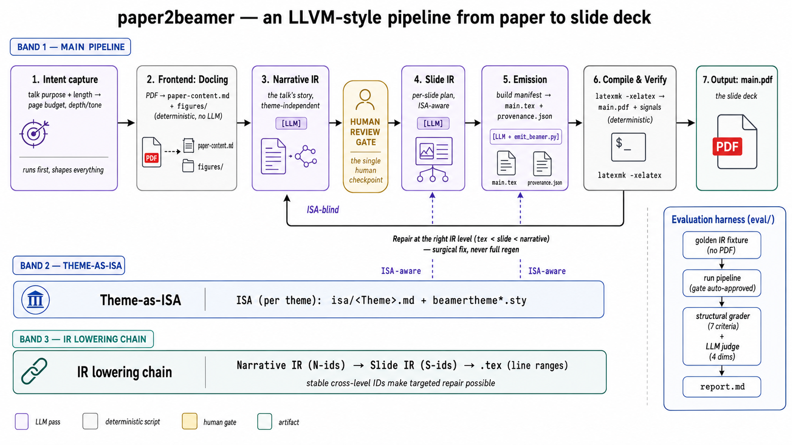
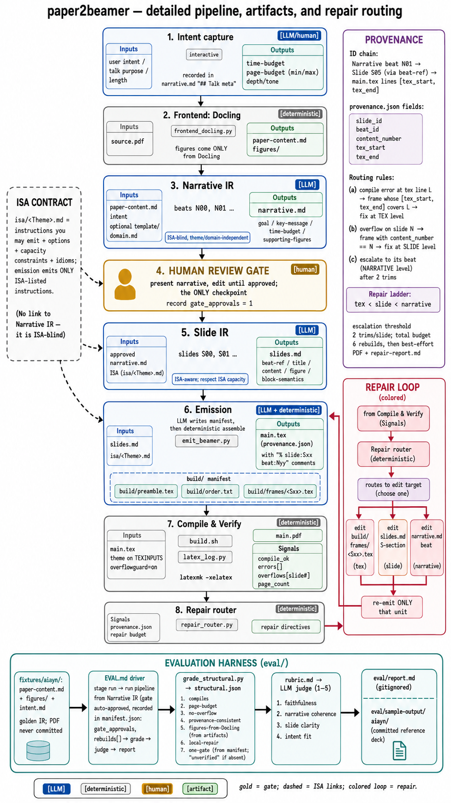

# paper2beamer

> [English](README.md)

一個受 LLVM IR 啟發的 Claude Code skill，可以把學術論文（PDF）轉成 Beamer 投影片。它有
兩個重點：一是 **intent-aware**，每次轉換前都會先問你這場報告要做什麼、講多久；二是
**theme-aware**，Beamer theme 被當成可以抽換的 backend。

圖片是用 **Docling 做 deterministic 抽取**，不會讓模型自己亂猜；投影片用 **XeLaTeX 編譯**；
萬一編譯失敗，它會在出問題的那一層修，而不是整份打掉重做。不分領域，各領域的研究者都能用。

## 運作方式



整條 pipeline 由左到右走；底下兩層分別是 theme-as-ISA 和 IR 的逐層下降鏈，評估工具
（evaluation harness）則放在右側。同一條流程的文字精簡版：

```
[Intent]  ->  [Docling 抽取]  ->  Narrative IR  ==關卡==>  Slide IR  ->  .tex  ->  [xelatex]  ->  修復
                  (圖片)          (故事線)      (人工審查)  (逐張規劃)  (組裝)     (PDF)      (對的層級)
```

三層 Markdown 中介表示（Narrative → Slide → `.tex`），再加上一層 theme-as-ISA。整個流程只有
一個需要你出手的關卡，就在 Narrative IR 之後；故事線要是歪掉，在這裡修最省事。過了這關就
全自動跑到底，連修復迴圈都不用你管。背後的設計理念可以看
[docs/design-philosophy.md](docs/design-philosophy.md) 和
[docs/ir-and-isa.md](docs/ir-and-isa.md)。

<details>
<summary>細節架構 —— 各階段的輸入輸出、產物、provenance 與修復路由</summary>



</details>

## 需求

- **XeLaTeX** 和 **latexmk**（TeX Live）。中文投影片還需要 `xeCJK` 加一套 CJK 字型。
- **uv**，用來跑 Python 工具（Docling 會在需要時才裝）。
- Claude Code，並把這個 repository 當成工作區。

## 安裝（只需一次）

最省事的方式：把這段話貼給 Claude Code，讓它幫你裝好。

> 幫我安裝 paper2beamer 這個 skill：把 `git@github.com:Haouo/PaperTalk-IR-Skills.git`
> clone 到 `~/workspace/`，把它的 `paper2beamer/` 資料夾 symlink 到
> `~/.claude/skills/paper2beamer`，再確認 `xelatex`、`latexmk`、`uv` 都有裝。

自己動手就這三步：

```bash
git clone git@github.com:Haouo/PaperTalk-IR-Skills.git ~/workspace/papertalk-ir-skills
ln -s ~/workspace/papertalk-ir-skills/paper2beamer ~/.claude/skills/paper2beamer
xelatex --version && latexmk --version && uv --version
```

開一個新的 Claude Code session，`paper2beamer` 就會出現在可用的 skill 裡。完整流程見
[TUTORIAL-zh-TW.md](TUTORIAL-zh-TW.md)。

## 快速開始

1. 在 Claude Code 裡請 skill 處理一篇論文：

   > 把 `paper.pdf` 做成投影片，15 分鐘的研討會報告。

2. Skill 會先問你的 **intent**，用 Docling 把 PDF 讀進來，先擬出 **Narrative IR**，然後停在
   **審查關卡**等你確認。
3. 你點頭之後，它會接著規劃 **Slide IR**、把投影片產生並組好、編譯，遇到爆頁或錯誤就在對的
   那一層修掉。
4. 最後成品是 `slides/<paper-slug>/main.pdf`，過程中的中間產物也都放在旁邊，方便你檢查。

## Theme

內建的 **Simple** theme（`template/beamerthemeSimple.sty`）已經附了一份預建好的 ISA，放在
`paper2beamer/isa/Simple.md`。想換別的 theme，就把它的 `beamerthemeXxx.sty` 丟進 `template/`，
把 `template/theme.tex` 指過去，再跑一次 **ISA setup** 產生 `isa/<Theme>.md` 就好。換 theme 的
時候 Narrative IR 可以直接沿用，不用重做。

## 可選的 setup

- **ISA setup**：讓 skill 認識一個新的 theme，每個 theme 設定一次就好。
- **Domain setup**：產生 `template/domain.md`，讓 skill 照你的領域去拿捏背景要鋪多少、術語
  怎麼統一（每個工作區設定一次）。不設定也沒關係，它就維持中立，不對任何領域做假設。

## 文件

- [TUTORIAL-zh-TW.md](TUTORIAL-zh-TW.md)：一步一步的完整教學。
- [docs/design-philosophy.md](docs/design-philosophy.md)：LLVM 類比和設計理念。
- [docs/ir-and-isa.md](docs/ir-and-isa.md)：IR 層級、ISA、provenance 的細節。
- [docs/VERIFICATION.md](docs/VERIFICATION.md)：怎麼驗證。
- [CONTRIBUTING.md](CONTRIBUTING.md)：開發流程和規範。

## 授權

MIT，見 [LICENSE.md](LICENSE.md)。
